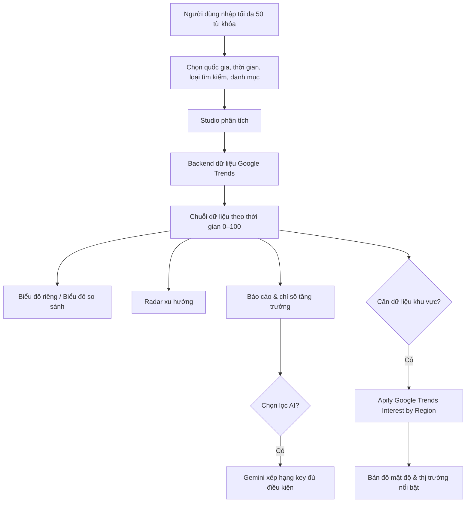

# 📈 TrendScope — Studio phân tích xu hướng từ khóa

[](https://trendscope-vn-studio.anhtuyet-spa1103.chatgpt.site)
[](https://trends.google.com/)
[](#bảo-mật-và-sử-dụng-api)

TrendScope là công cụ hỗ trợ nghiên cứu và so sánh xu hướng tìm kiếm cho tối đa 50 từ khóa trong cùng một phiên phân tích. Công cụ hướng đến nhà sáng tạo nội dung, marketer và người nghiên cứu thị trường cần nhận diện chủ đề tăng trưởng, nhu cầu tìm kiếm và cơ hội ngách.

> **Trang đang chạy:** [trendscope-vn-studio.anhtuyet-spa1103.chatgpt.site](https://trendscope-vn-studio.anhtuyet-spa1103.chatgpt.site)

---

## ✨ Tính năng nổi bật

- **Phân tích đa từ khóa:** nhập tối đa 50 từ khóa, lọc trùng lặp và chạy theo quốc gia, thời gian, loại tìm kiếm và danh mục đã chọn.
- **Biểu đồ theo dữ liệu thực:** xem biểu đồ riêng cho từng key hoặc biểu đồ so sánh gộp; trục chỉ số hiển thị thang Google Trends 0–100.
- **Phân loại xu hướng:** sắp xếp theo tăng trưởng, chỉ số hiện tại, đỉnh cao, tên, thứ tự thêm vào hoặc trạng thái xu hướng.
- **Radar xu hướng:** tổng hợp tín hiệu từ kết quả Studio thay vì dùng dữ liệu minh họa.
- **Khu vực & mật độ thị trường:** làm mới dữ liệu vùng bằng Apify/Google Trends theo đúng quốc gia và phạm vi Studio đang chọn.
- **Báo cáo đã lưu:** tạo, xem và xóa báo cáo trong thư viện cục bộ của trình duyệt.
- **Chọn lọc bằng Gemini:** xếp hạng key theo quỹ đạo 7, 30 hoặc 90 ngày với các tiêu chí Opportunity → Emerging → Momentum → Growth → Demand → Stability → Lowest Competition.
- **Kết nối API cá nhân:** Gemini, Apify và Thordata được lưu riêng trên từng trình duyệt; token mặc định hiển thị dạng ẩn.

---

## 🧭 Luồng hoạt động



---

## 🚀 Khởi chạy nhanh

### 1. Điều kiện cần

- Git.
- Một trình duyệt hiện đại: Chrome, Edge, Firefox hoặc Safari.
- Node.js nếu muốn dùng máy chủ tĩnh cục bộ qua `npx`.

### 2. Tải mã nguồn

```bash
git clone https://github.com/bebaycf-hub/Trendscope.git
cd Trendscope
```

### 3. Mở giao diện cục bộ

Giao diện là trang tĩnh nằm trong thư mục `dist`. Có thể dùng Live Server của VS Code hoặc chạy:

```bash
npx serve dist
```

Mở địa chỉ mà lệnh trả về trong trình duyệt.

> Khi chạy cục bộ, giao diện mặc định sử dụng backend đã cấu hình trong `dist/index.html`. Để tự vận hành độc lập, hãy triển khai backend của bạn và gán `window.TRENDSCOPE_API_BASE` trước khi tải trang.

---

## 🧩 Cấu trúc dự án

```text
Trendscope/
├── dist/
│   ├── index.html        # Giao diện, biểu đồ và logic phía trình duyệt
│   └── _worker.js        # Worker adapter cho Google Trends / SerpApi
├── backend/
│   ├── server.mjs        # Backend Node.js tùy chọn
│   └── README.md         # Hướng dẫn backend
├── .openai/
│   └── hosting.json      # Cấu hình xuất bản Sites
└── README.md             # Tài liệu này
```

---

## 🔌 Kết nối API cá nhân

Mở tab **Kết nối API** trên TrendScope và tự nhập token của bạn.

| Nhà cung cấp | Mục đích | Khi nào được gọi |
|---|---|---|
| Gemini | Chọn lọc và giải thích thứ hạng key trong báo cáo | Khi bấm phân tích chọn lọc Gemini |
| Apify | Lấy `interest_by_region` để hiển thị vùng quan tâm | Khi bấm làm mới bản đồ bằng Apify |
| Thordata | Nguồn token cá nhân sẵn sàng cho kết nối Thordata | Chỉ khi tính năng Thordata được cấu hình sử dụng |

Các token được lưu trong `localStorage` của **trình duyệt đang dùng**, không nằm trong repository và không tự đồng bộ cho người dùng khác.

---

## 📊 Cách đọc dữ liệu

- Chỉ số Google Trends **0–100** là chỉ số tương đối, không phải số lượng tìm kiếm tuyệt đối.
- Mỗi thay đổi về quốc gia, thời gian, danh mục hoặc loại tìm kiếm sẽ tạo một phạm vi chuẩn hóa khác.
- Khi Google Trends hoặc nguồn khu vực không trả dữ liệu, TrendScope phải giữ trạng thái “không có dữ liệu” thay vì bù bằng biểu đồ giả.
- Dữ liệu Apify theo vùng cũng phụ thuộc vào quốc gia được chọn trong Studio. Ví dụ, `KR`, `VN`, `JP` sẽ trả về các đơn vị địa lý khác nhau.

---

## 🛠️ Phát triển và xuất bản

```bash
# Kiểm tra thay đổi
git status

# Ghi nhận thay đổi
git add .
git commit -m "Mô tả thay đổi"

# Đẩy lên GitHub
git push origin main
```

Để cập nhật trang đang hoạt động, cần xuất bản lại qua Sites/Codex sau khi commit. Nếu dùng Codex, chỉ cần mở thư mục dự án và yêu cầu: **“Hãy xuất bản bản mới nhất của TrendScope.”**

---

## 🔐 Bảo mật và sử dụng API

1. **Không commit API token** vào GitHub, `index.html`, README, ảnh chụp màn hình hoặc file cấu hình.
2. Nếu token từng bị lộ, hãy thu hồi token tại nhà cung cấp và tạo token mới.
3. Không chia sẻ token với người dùng khác; mỗi người tự dùng quota và tài khoản của mình.
4. Repository nên để **Private** nếu mã nguồn hoặc quy trình nội bộ không dành cho công chúng.
5. File `deployment-*.tar.gz` là gói triển khai; không cần thêm các gói mới vào commit thông thường.

---

## 🤝 Đóng góp

Mở Issue hoặc Pull Request trên GitHub với mô tả rõ:

- vấn đề gặp phải;
- bước tái hiện;
- ảnh màn hình đã che thông tin nhạy cảm;
- kết quả mong muốn.

---

<p align="center">Xây dựng cho nghiên cứu xu hướng có cơ sở dữ liệu, rõ phạm vi và tôn trọng quyền riêng tư API.</p>
